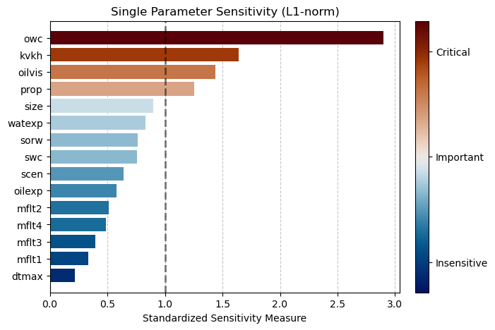
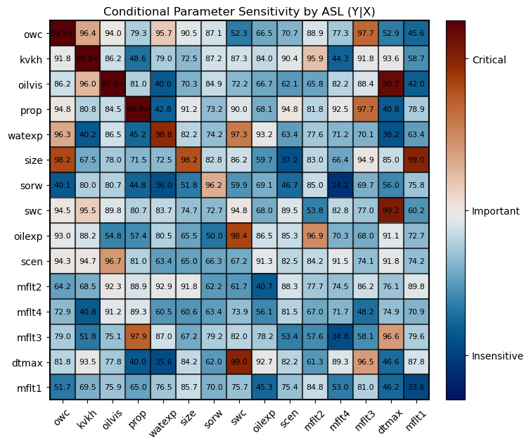
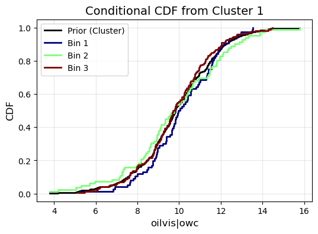

# Distance-based Generalized Sensitivity Analysis (DGSA)
[](https://opensource.org/licenses/MIT)
## Overview
A Python package for performing distance-based generalized sensitivity analysis
## Authors
Jihui Ding, jihuid@stanford.edu
## Features
- Compute single parameter sensitivity and condtional parameter sensitivity (two-way parameter interaction)
- Generate Pareto, heatmap, CDF plots using a perceptually uniform colormap






## How to Use

1. **Explore the Example Notebooks**  
   Run the Jupyter notebooks included in this repository to learn the DGSA workflow (computation and visualization) using the provided example dataset.

2. **Prepare Your Own Data**  
   Format your inputs to match the example files:
   - **Parameter file:** a CSV containing model parameters.
   - **Response file:** either a CSV of responses or a **distance matrix** CSV.  
   Ensure the column structure and file format follow the examples.

3. **Run DGSA with Your Data**  
   Replace the example data paths in the notebooks with your own files and adjust any DGSA settings as needed.

## Repository Structure

```plaintext
├── DGSA_computation_Park2016.ipynb
├── DGSA_visualization_Park2016.ipynb
├── LICENSE
├── README.md
├── computation
│   ├── conditional_parameter_sensitivity.py
│   ├── kmedoids.py
│   └── single_parameter_sensitivity.py
├── example_data
│   ├── Park2016_distance_matrix.csv
│   ├── Park2016_parameters.csv
│   └── example_responses.csv
├── example_plots
│   ├── Park2016_MDS.png
│   ├── Park2016_conditional_ASL.png
│   ├── Park2016_conditional_CDF.png
│   └── Park2016_single_l1norm.png
├── example_results
│   └── Park2016_DGSA_results.pkl
├── utils
│   └── DGSA_save_load.py
└── visualization
    ├── cluster_MDS.py
    ├── conditional_cdf.py
    ├── conditional_heatmap.py
    ├── single_cdf.py
    └── single_pareto.py
```
## Acknowledgement

**Methodology developed by:**

Fenwick, D., Scheidt, C., & Caers, J. (2014). Quantifying asymmetric parameter interactions in sensitivity analysis: application to reservoir modeling. *Mathematical Geosciences, 46(4), 493–511.*

**Example data from:**

Park, J., Yang, G., Satija, A., Scheidt, C. and Caers, J. (2016). DGSA: A Matlab toolbox for distance-based generalized sensitivity analysis of geoscientific computer experiments. *Computers & geosciences, 97, 15-29.*

**Early Implementations**

| Version | Author | Repository |
|--------|--------|------------|
| MATLAB | Céline Scheidt | https://github.com/lewisli/QUSS |
| MATLAB | Jihoon Park | https://github.com/SCRFpublic/DGSA |
| Python (light) | David Yin | https://github.com/SCRFpublic/DGSA_Light |

We acknowledge and appreciate the contributions of the above researchers and developers whose work laid the foundation for this implementation.


